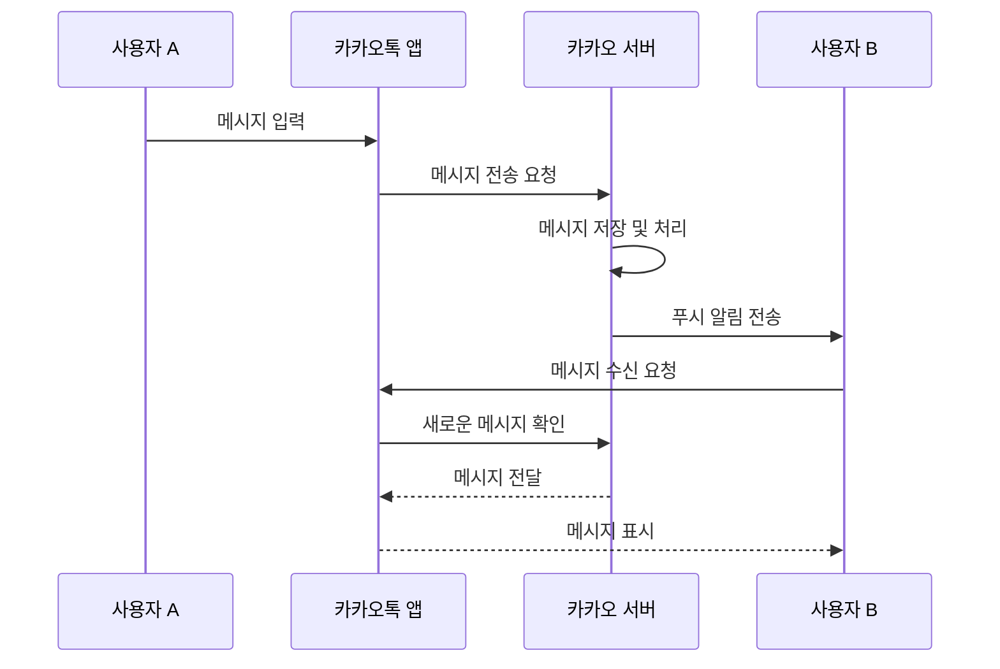

# 개인 실습 과제 1

## 📌 주제
일상 속 소프트웨어 사용 사례 – 카카오톡 메시지 전송 흐름

## ✅ 시퀀스 다이어그램 (Mermaid)



## ✅ 샘플 코드 설명

- `message_store.py`: 메시지를 임시 저장하는 모듈 (`MessageStore` 클래스)
- `server.py`: 메시지를 수신/저장/푸시알림 처리하는 서버 역할 (`KakaoServer` 클래스)
- `app.py`: 사용자의 앱 역할, 메시지를 전송하거나 수신함 (`KakaoApp` 클래스)
- `main.py`: 전체 흐름을 시뮬레이션하는 실행용 스크립트

## ✅ 모듈 평가 결과

| 모듈 | 응집도 | 결합도 | 설명 |
|------|--------|--------|------|
| `message_store.py` | 높음 | 낮음 | 메시지 저장 기능에 집중 |
| `server.py`        | 중간 | 중간 | 서버 처리 + 푸시 알림 기능 |
| `app.py`           | 중간 | 중간 | 사용자와 서버 간 연결 기능 중심 |
| `main.py`          | 낮음 | 낮음 | 실행 흐름만 담당 |

## ✅ 실행 방법

```bash
python main.py
```

## ✅ 실행 예시 출력

```
[앱:user1] 메시지 전송 요청 → 서버
[서버] user1 -> user2: 메시지 수신
[서버] user2 에게 푸시 알림 전송

--- 사용자 B 메시지 수신 ---

[앱:user2] 서버로부터 메시지 요청
[앱:user2] 수신된 메시지: user1: 안녕, 저녁 뭐 먹을 거야?
```
